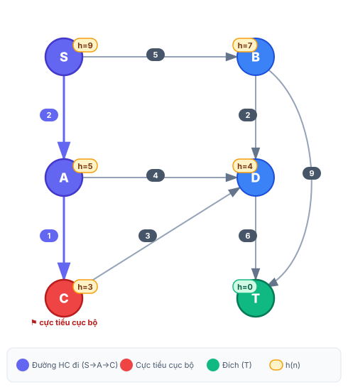

# Hill Climbing — Ôn tập chuyên sâu

**EP15/EP16.TOKT11121 – Introduction to Artificial Intelligence**

---

## 1. Ý tưởng cốt lõi

Hill Climbing (Leo đồi) là thuật toán **tìm kiếm cục bộ**: tại mỗi bước, nó chỉ nhìn vào các nút kề ngay lập tức và chuyển sang nút có **h(n) thấp nhất** — không lưu lịch sử, không quay lui.

> Hình ảnh trực quan: hãy tưởng tượng bạn đứng trên một bề mặt có đồi núi trong sương mù. Bạn không nhìn thấy toàn cảnh — chỉ biết độ dốc ngay dưới chân. Bạn luôn bước xuống chỗ thấp hơn, cho đến khi không còn chỗ nào thấp hơn xung quanh nữa. Đó là cực tiểu cục bộ — dù toàn cục có thể còn thấp hơn nữa.

---

## 2. Quy tắc thực hiện (6 bước)

| Bước | Hành động |
|:----:|-----------|
| 1 | Bắt đầu tại nút khởi đầu. Đây là **nút hiện tại**. |
| 2 | Sinh tất cả **nút kề** (các nút có thể đến từ nút hiện tại). |
| 3 | Chọn nút kề có **h(n) nhỏ nhất**. Nếu hòa → chọn theo thứ tự bảng chữ cái. |
| 4 | Nếu h(nút kề tốt nhất) **< h(nút hiện tại)** → **di chuyển** đến đó. |
| 5 | Nếu **không có nút kề nào** cải thiện (h ≥ h hiện tại) → **dừng** (cực tiểu cục bộ). |
| 6 | Lặp lại từ bước 2 cho đến khi đến đích hoặc dừng. |

---

## 3. Tính chất

| Tính chất | Hill Climbing |
|-----------|:-------------:|
| Dùng h(n)? | ✓ Có |
| Theo dõi g(n) (chi phí đường đi)? | ✗ Không |
| Có danh sách OPEN? | ✗ Không |
| Có thể quay lui? | ✗ Không |
| Đảm bảo tìm được đích? | ✗ Không |
| Đảm bảo tối ưu? | ✗ Không |
| Độ phức tạp bộ nhớ | O(1) — chỉ lưu nút hiện tại |

**Kết luận:** Hill Climbing nhanh và tiết kiệm bộ nhớ, nhưng **không đầy đủ** và **không tối ưu**. Nó có thể bị kẹt tại **cực tiểu cục bộ** — nút có h nhỏ hơn tất cả các nút kề, nhưng chưa phải đích.

---

## 4. Đồ thị minh họa

**Dữ liệu đồ thị:**

| Cạnh | Chi phí | | Nút | h(n) |
|------|---------|-|-----|:----:|
| S → A | 2 | | S | 9 |
| S → B | 5 | | A | 5 |
| A → C | 1 | | B | 7 |
| A → D | 4 | | C | **3** |
| B → D | 2 | | D | 4 |
| B → T | 9 | | T | 0 |
| C → D | 3 | | | |
| D → T | 6 | | | |

**Câu hỏi:** Hill Climbing từ S đến T sẽ đi theo đường nào? Có đến được T không?

---

## 5. Giải Hill Climbing — phương pháp kẻ bảng

Mỗi hàng là một bước. Cột **Quyết định** giải thích vì sao chọn hoặc dừng.

| Bước | Nút hiện tại | h(hiện tại) | Nút kề | h(kề) | Quyết định |
|:----:|:------------:|:-----------:|--------|:-----:|------------|
| 1 | **S** | 9 | A, B | 5, 7 | h(A)=5 < 9 → chọn A |
| 2 | **A** | 5 | C, D | 3, 4 | h(C)=3 < 5 → chọn C |
| 3 | **C** | 3 | D | 4 | h(D)=4 > 3 → **DỪNG** ⚑ |

> **Kết quả:** Hill Climbing bị kẹt tại **C** (cực tiểu cục bộ). Không tìm được đường đến T.

**Tại sao C là cực tiểu cục bộ?**  
C chỉ có một nút kề là D với h(D)=4. Vì 4 > 3 = h(C), Hill Climbing không thể tiến thêm. Dù có thể đến T qua C→D→T, thuật toán không biết điều này vì nó không nhìn xa hơn một bước.

---

## 6. So sánh: Greedy Best-First trên cùng đồ thị

Greedy Best-First (Tham lam tốt nhất) cũng dùng h(n), nhưng duy trì **danh sách OPEN** và có thể **khám phá lại** các nút kề đã thấy trước đó.

### Bảng giải Greedy Best-First

| Bước | OPEN (nút, h) | Mở rộng | Thêm vào OPEN | Ghi chú |
|:----:|--------------|:-------:|---------------|---------|
| 0 | {(S,9)} | S | A(5), B(7) | Bắt đầu |
| 1 | {(A,5),(B,7)} | A | C(3), D(4) | h(A)=5 nhỏ nhất |
| 2 | {(C,3),(D,4),(B,7)} | C | D(4)* | h(C)=3 nhỏ nhất |
| 3 | {(D,4),(B,7)} | D | T(0) | h(D)=4 nhỏ nhất; D đã trong OPEN, giữ nguyên |
| 4 | {(T,0),(B,7)} | **T** | — | h(T)=0 → **ĐẾN ĐÍCH** ✓ |

> *D đã có trong OPEN với h=4; không thêm lại.

**Đường đi Greedy:** S → A → C → D → T  
**Chi phí:** g = 2 + 1 + 3 + 6 = **12**

---

## 7. Bảng so sánh tổng hợp

| Tiêu chí | Hill Climbing | Greedy Best-First |
|----------|:-------------:|:-----------------:|
| Danh sách OPEN | ✗ | ✓ |
| Quay lui / thử lại | ✗ | ✓ (qua OPEN) |
| Bộ nhớ | O(1) | O(b·d) |
| Tìm được đích? | ✗ (kẹt tại C) | ✓ |
| Chi phí đường đi | — | 12 (không tối ưu) |
| Tối ưu? | ✗ | ✗ |

**Đường tối ưu thực sự:** S→A→D→T với chi phí = 2+4+6 = **12** (bằng Greedy) hoặc kiểm tra thêm các đường khác bằng thuật toán đầy đủ như A\*.

---

## 8. Điểm mấu chốt cần nhớ

1. **Hill Climbing không có bộ nhớ** — khi đến C, nó đã "quên" mất S và A. Không có cách nào quay lại.
2. **Cực tiểu cục bộ ≠ cực tiểu toàn cục** — h(C)=3 nhỏ hơn mọi nút kề, nhưng T (h=0) mới là đích thực sự.
3. **Greedy thoát được** vì OPEN list lưu D từ bước 2 — khi C mở rộng ra D, D đã sẵn sàng trong hàng đợi.
4. **Cả hai không tối ưu** — chúng không theo dõi g(n), chỉ dùng h(n) để quyết định. Muốn tối ưu cần A\*.

---

## 9. Bẫy thường gặp khi làm bài

| Lỗi sai | Đúng |
|---------|------|
| HC tiếp tục dù h(kề) = h(hiện tại) | HC **dừng** khi không có kề nào *tốt hơn* (h nghiêm ngặt thấp hơn) |
| Greedy không thêm D vào OPEN vì "đã thấy" | Greedy thêm vào OPEN khi **chưa có**; nếu đã có thì so sánh và giữ tốt nhất |
| Tính chi phí Greedy theo số bước | Chi phí là **tổng trọng số cạnh**, không phải số bước |
| Nhầm h(n) với g(n) | h(n) = ước lượng còn lại đến đích; g(n) = chi phí đã đi từ đầu |

---

## 10. Hill Climbing thuần túy vs. Hill Climbing hiện đại (trong slide)

Tên "Hill Climbing" được dùng theo **hai nghĩa khác nhau** trong các tài liệu AI. Phân biệt rõ để không nhầm lẫn giữa slide tuần 3 và bài lab tuần 4.

### Hai biến thể

| | **HC thuần túy** | **HC hiện đại (trong slide)** |
|---|---|---|
| Dùng h(n)? | ✓ | ✓ |
| Có danh sách OPEN? | **Không** — chỉ lưu nút hiện tại | **Có** — ngăn xếp có sắp xếp theo h |
| Xử lý nút con | Chỉ giữ nút kề tốt nhất | Sắp xếp toàn bộ nút con theo h, đẩy vào đầu OPEN |
| Có thể quay lui? | Không | Có (qua các mục còn lại trong OPEN) |
| Khi gặp đồ thị minh họa | Kẹt tại C — bỏ lỡ T | Có thể tìm được T qua OPEN |
| Bộ nhớ | O(1) | Như DFS — tỷ lệ với độ sâu × nhánh |
| Đảm bảo tìm được đích? | Không — kẹt tại cực tiểu cục bộ | Không — rủi ro như DFS, nhưng không bị "mất bộ nhớ" |
| Tên trong sách giáo khoa | AIMA "hill-climbing search" | HC theo Winston / MIT 6.034; Poole gọi là *heuristic depth-first search* |

### Giải thích

**HC thuần túy** (Russell & Norvig, AIMA chương 4): hoàn toàn là **tìm kiếm cục bộ**. Không có OPEN list; khi không có nút kề nào tốt hơn, thuật toán dừng hoàn toàn. Đây là dạng được dùng trong bài lab tuần 4 khi nghiên cứu *tại sao tìm kiếm cục bộ thất bại*.

**HC hiện đại / trong slide** (slide `2.Searching_2.pdf`, MIT 6.034 của Winston): thực chất là **DFS có hướng dẫn bởi heuristic**. Nút con được sắp xếp theo h và đẩy vào đầu OPEN. Khi một nhánh thất bại, OPEN vẫn còn lưu các nhánh thay thế đã gặp trước đó. Đây là dạng được dùng trong slide tuần 3.

> **Lưu ý đặt tên:** AIMA giữ tên "hill climbing" cho dạng cục bộ thuần túy. Poole & Mackworth gọi dạng OPEN-list là *heuristic depth-first search*. Cả hai tên đều có cơ sở trong tài liệu; điều quan trọng khi làm bài là xác định **quy tắc nào** được yêu cầu áp dụng.

---

## 11. Tài liệu tham khảo

- **Russell, S. & Norvig, P.** — *Artificial Intelligence: A Modern Approach*. Hill-climbing search được định nghĩa là tìm kiếm cục bộ không có fringe (AIMA, chương 4).
- **Winston, P.** — MIT 6.034. Hill climbing được định nghĩa là DFS với nút con sắp xếp theo heuristic và đẩy vào đầu hàng đợi.
- **Poole, D. & Mackworth, A.** — *Artificial Intelligence: Foundations of Computational Agents*. Dạng OPEN-list được gọi là *heuristic depth-first search*.
- **Slide môn học:** `slides/2.Searching_2.pdf` — Hill climbing dạng hiện đại (OPEN-list).
